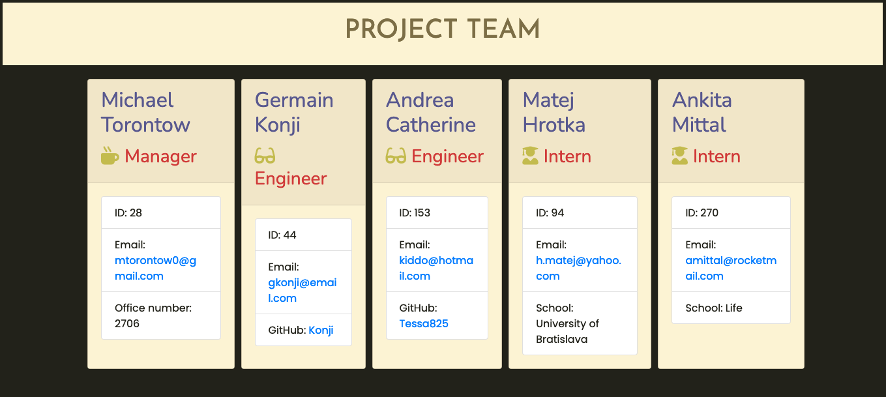

# Template Engine--Employee Summary

## Description 

Good day! When you create a team for a project, you would like to have a summary of those team members in a file you can use to easily reference names, roles, contact information, and depending on their role, other pertinent information. Using Inquirer.js, this CLI project allows a user to answer some questions about their team members and outputs an HTML file that, when opened, is nicely styled, organized, and user-friendly.

## TABLE OF CONTENTS

1. [Installation](#Installation)
2. [Usage](#Usage)
3. [Contributing](#Contributing)
4. [Tests](#Tests)
5. [Questions/Contact](#Questions/Contact)
6. [License](#License)

## Installation

Users will retrieve the code from [this GitHub repository](https://github.com/Torontow/MT-Template_Engine-Employee_Summary). Note that Node.js, Inquirer.js, and Jest are required. Run `npm install` first to install dependencies, then run `node app.js` in an integrated terminal to begin.

## Usage

Run `node app.js` in your terminal to begin. You will be asked to choose the `role` of the employee you would like to add (Manager, Engineer, or Intern). Then, depending on the role you choose, you will be asked to answer a series of questions requiring user input. Note: the questions do vary slightly depending on the role. For example, a Manager will require an office number, but an Intern will require a school name. 

Once the questions are answered, you'll be prompted if you'd like to add another employee to the team. You may add as many as you wish. Once finished, select "no" when prompted, and a new file called `team.html` will be waiting for you in the `output` folder. 

If you display the file in a browser, the file will be styled as above, containing as many team members as you wished. Click an email address to send the team member an email from your default email application. Click a GitHub name to be directed to that team member's GitHub profile.

## Contributing

Contributors may contact me below for additions. Please follow the Contributing Code of Conduct. 

## Tests

There are test files included in the package to make sure the individual class objects are created and referenced properly. 

## Questions/Contact

GitHub Profile: [https://github.com/Torontow](https://github.com/Torontow)
Email: [mtorontow0@gmail.com](mailto:mtorontow0@gmail.com)

## License

This project is covered under MIT license.

[Top](#Template-Engine--Employee-Summary)
